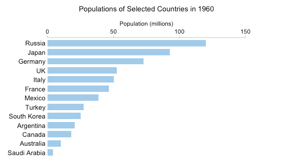
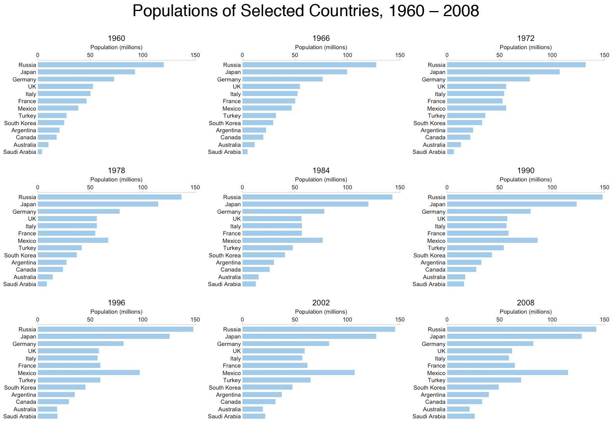

# Small-multiples

## Definition and utility :
Small multiples go by many names, including Trellis Chart, Lattice Chart, Grid Chart, and Panel Chart.
Small multiples are sets of charts of the same type, with the same scale, presented together at a small size and with minimal detail, usually in a grid of some kind.
They are a visualization concept introduced by Edward Tufte. He described them as:
"Illustrations of postage-stamp size are indexed by category or a label, sequenced over time like the frames of a movie, or ordered by a quantitative variable not used in the single image itself."
In other words, small multiples use the same basic graphic or chart to display difference slices of a data set. Small multiples can show rich, multi-dimensional data without trying to cram all that information into a single, overly-complex chart. 
Here is a simple example showing the use of small multiples. The following animated chart shows the evolution of populations in some selected countries :
<table border="0">
  <tr>
    <td>
      
    </td>
  </tr>
  <tr>
    <td align="center" bgcolor="EFEFEF">
      Animated representation for population growth [1]
    </td>
  </tr>
</table>

This GIF image has 54 separate frames. It's not particularly practical to create a small multiple graphic with 54 separate charts, but we can still get a good idea of the changes taking place by "sampling" the data every six years:
<table border="0">
  <tr>
    <td>
      
    </td>
  </tr>
  <tr>
    <td align="center" bgcolor="EFEFEF">
      Small multiple chart of population growth on each 6 years[2]
    </td>
  </tr>
</table>

This way, you can actually browse the small multiple layout at your leisure. You can clearly see the rapid rise in the population of Mexico, for instance. You can see that the population roughly doubled from just over 50 million in 1972 to a little over 100 million by 2002. To get his kind of information from the GIF you have to keep details in working memory while you wait for the frames to progress.
This show the utility of **small multiple charts**.

##Historical examples 

### 1886 : Horse in motion 

Some of the earliest known examples of this type of visualization include the photographic series Horse In Motion by Eadweard Muybridge, around 1886, and Francis Amasa Walker's chart of citizen's occupations in census year 1870 appearing in the Statistical Atlas of the United States.
<table border="0">
  <tr>
    <td>
      
    </td>
  </tr>
  <tr>
    <td align="center" bgcolor="EFEFEF">
      Small multiple chart of a horse's motion[3]
    </td>
  </tr>
</table>
Muybridge's work not only proved for the first time that all four of a horse's hooves left the ground during gallop (see upper central plates), but it also broke new ground in terms of artistic expression and became foundational to the development of the motion picture. Muybridge went on to produce many more examples of small multiples showing animal locomotion through the medium of stop-motion photography, including boys playing leapfrog and a bison cantering. []

### 1874 : 
Persons with gainful occupations and attending school, Walker (1874)

This graphic is innovative in its use of both a treemap display and a latticed layout of small multiples. Additional examples appearing in the [Atlas](https://fraser.stlouisfed.org/scribd/?title_id=64&filepath=/docs/publications/stat1870/Stat_Atlas1870.pdf) include side-by-side geographic maps showing the changes in population over time, as well as tiled mosaic charts showing population demographic breakdowns, and diverging bar graphs showing deaths broken down by age and gender, tiled by state.

<table border="0">
  <tr>
    <td>
      
    </td>
  </tr>
  <tr>
    <td align="center" bgcolor="EFEFEF">
      Persons with gainful occupations and attending school, Walker (1874)[4]
    </td>
  </tr>
</table>

